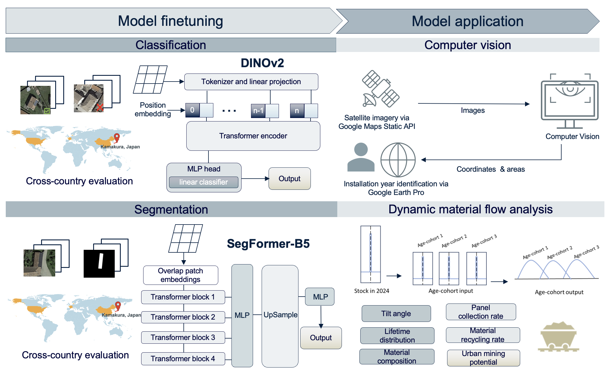

# SolarScope: Estimating Urban Mining Potential of Distributed Solar Panels

## Read the full article published in RCR here:
https://pubs.acs.org/doi/10.1021/acs.est.5c01600

## Project Overview
The rapid deployment of solar photovoltaic (PV) systems has created a growing challenge in managing end-of-life panels. While many studies project future recycling potential, they are often limited by the lack of data on existing distributed PV installations. To address this need, we developed SolarScope, an open-source model that integrates computer vision (CV) with dynamic material flow analysis (dMFA) to automatically identify distributed PV panel areas and evaluate the urban mining potential. By leveraging satellite imagery and Vision Transformer (ViT) models, SolarScope achieves an Area under the Receiver Operating Characteristic Curve (AUROC) of 0.93 for classification and a Dice Similarity Coefficient (Dice) score of 0.90 for segmenting distributed PV installations. A case study in Kamakura, Japan, demonstrates the model’s transferability and its ability to support material recovery assessments at fine spatial scales. We present a methodological framework that combines CV with dMFA to bottom-up estimate the regional material stock and recycling potential of distributed PV systems, providing a scalable solution to overcome data limitations in conventional material flow analysis and contributing to circular economy advancement.

### Model Overview
The model architecture and workflow are illustrated below:

## Environment Setup
To replicate this project and run the provided Jupyter Notebooks, follow the steps below to set up the required environment.

### 1. Clone the Repository
git clone https://github.com/Peijin-Jiang/SolarScope

cd SolarScope

### 2. Install Dependencies
pip install -r requirements.txt

### 3.Data Availability
The fine tuning and validation data required to run the models is from four studies:

1) Bradbury, K., Saboo, R., L. Johnson, T., Malof, J. M., Devarajan, A., Zhang, W., M. Collins, L., & G. Newell, R. (2016). Distributed solar photovoltaic array location and extent dataset for remote sensing object identification. Scientific Data, 3(1), 160106. https://doi.org/10.1038/sdata.2016.106
2) Khomiakov, M., Radzikowski, J. H., Schmidt, C. A., Sørensen, M. B., Andersen, M., Andersen, M. R., & Frellsen, J. (2022). SolarDK: A high-resolution urban solar panel image classification and localization dataset (arXiv:2212.01260). arXiv. https://doi.org/10.48550/arXiv.2212.01260
3) Kasmi, G., Saint-Drenan, Y.-M., Trebosc, D., Jolivet, R., Leloux, J., Sarr, B., & Dubus, L. (2023). A crowdsourced dataset of aerial images with annotated solar photovoltaic arrays and installation metadata. Scientific Data, 10(1), 59. https://doi.org/10.1038/s41597-023-01951-4
4) Jiang, H., Yao, L., Lu, N., Qin, J., Liu, T., Liu, Y., & Zhou, C. (2021). Multi-resolution dataset for photovoltaic panel segmentation from satellite and aerial imagery. Earth System Science Data, 13(11), 5389–5401. https://doi.org/10.5194/essd-13-5389-2021

The prediction images for Kamakura, Japan can be obtained by running the prediction_image_import.ipynb notebook (with your own Google Staic Maps API)

After downloading the data, replace the paths in the Jupyter Notebooks to point to the corresponding local directories.

### 4. Model Availability
The finetuned DINOv2 model and Segformer-B5 model are stored here: https://drive.google.com/drive/folders/1eNHFISSINX_g-8BskpTayL5Mj0uysCcY?usp=sharing
